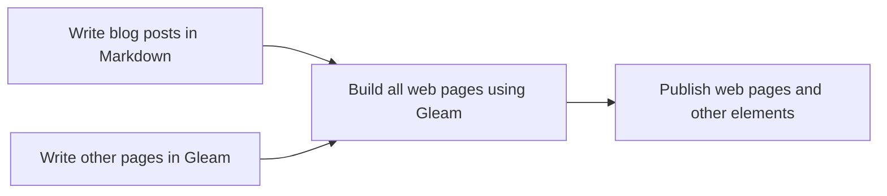

---
id = "writing-a-static-website-in-gleam"
slug = "writing-a-static-website-in-gleam"
title = "🧑‍💻 Writing a static website in Gleam"
abstract = "TBD"
tags = ["Gleam"]
publication_date = "2024-09-03"
draft = true
---

In my [previous post](a-journey-to-the-stars.html), I presented the basic tenets
of the Gleam programming language. In short, it is a friendly, functional
language, aimed to build scalable systems, mainly by relying on the BEAM virtual
machine.

Another great thing about Gleam is that it can also compile to Javascript, thus
allowing you to build dynamic web-pages, in a type-safe way, without having to
learn a whole new language and type system (via Typescript).

In this post, I will cover the process in building a static website, such as
[this one](https://maximefilippini.me), using a neat Gleam library called
**lustre**.

## What are static websites?

In simple terms, static websites are websites for which all content is the same
for all users, and they can either include interactive elements on their pages
or not.

For you to have a static website, you only need the following elements:

- A set of **HTML pages**, which represent the mark-up of your pages;
- A set of **CSS files**, which contain the styling of your pages; and
- A set of **Javascript files** for your interactive elements (optional).

You could be an artisan and build all these files by hand, or choose a way to
build them using code, so that everything can be more neatly organized, and more
easily updatable in the future. Another advantage of using code to build your
pages is when you need some kind of _conversion_ to happen.

For example, no one in their right mind would be writing their blog posts in raw HTML, and would
instead favor a more practical format, like a
[WYSIWYG](https://en.wikipedia.org/wiki/WYSIWYG) editor, which usually comes
with Content Management Systems like [Ghost](https://ghost.org/) or
[Wordpress](https://wordpress.com/), or a more-suited file type, like
[Markdown](https://en.wikipedia.org/wiki/Markdown) (what I ended up settling on
for my own blog).

The overall process of writing this blog can be summarized by the following
diagram.



> Note: I've used [Mermaid](https://mermaid.js.org/) to build this diagram, for which I added support in my Gleam program that converts my Markdown pages to HTML.

## Converting blog posts

The most popular file format for writing blog posts is Markdown, because its
syntax is very simple, the mark-up does not get in the way of the content, and
it is trivial to include both code and math blocks, which is great for technical
contents.

Here is a short example of the Markdown syntax:

````markdown
# This is a heading

This is some text, some in _italic_, some in **bold**.

## This is a sub-heading

<!-- This is a comment -->

```gleam
import gleam/io

pub fn main() {
  io.println("This is a code block!")
}
```

$$
  \text{This is a Math block}
$$
````
